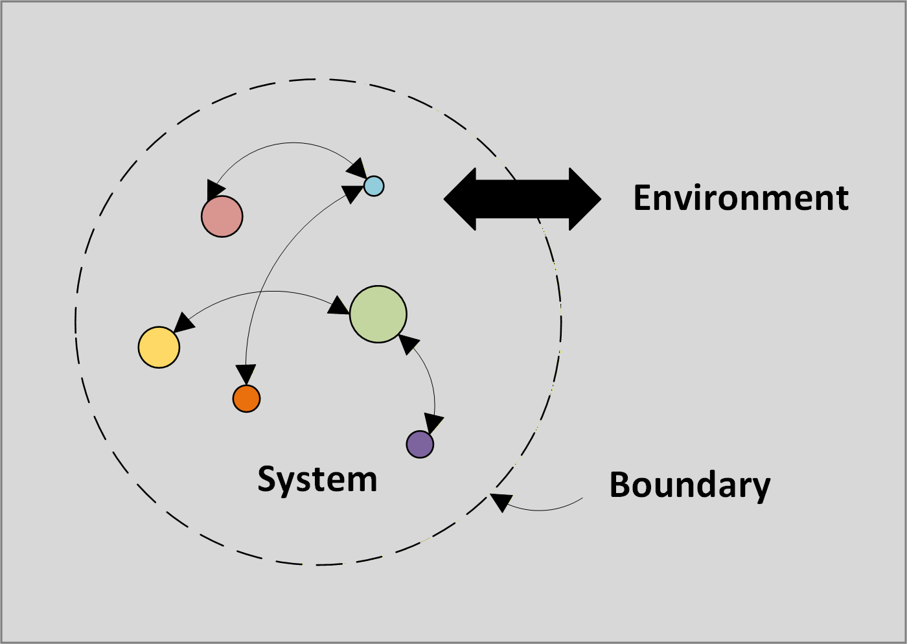
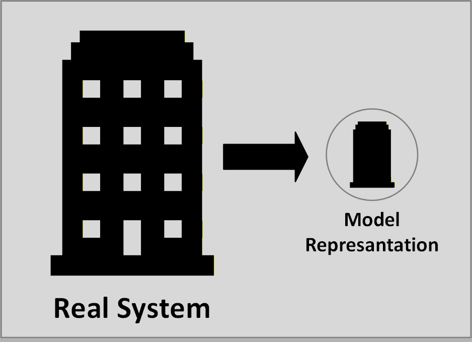
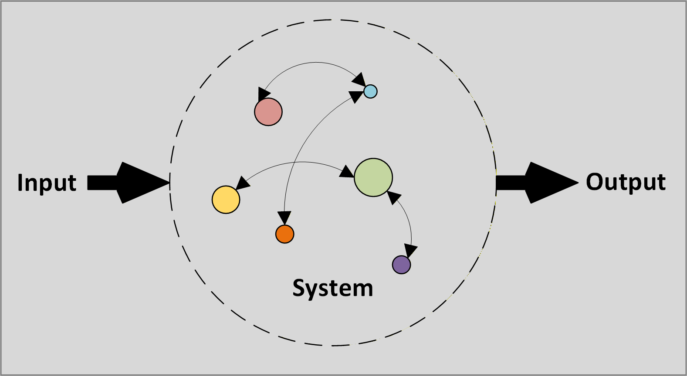
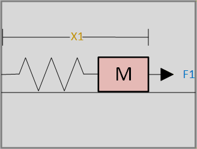

## Systems and models

### **System** 
Set of elements interacting among themselves and with the environment. 

>
> 
> System Example

A system is a collection of interconnected components that work together for a common purpose, transforming inputs into outputs. 

Think of it as a "black box" that has: 

* **Inputs**: SOmething you put into the box (signal, forces, materials, information).

* **Outputs**: Something you get out of the box (results, responses, products).

* **Internal Behavior**: The complex, often hidden, interactions *inside* the box that perform the transformation. 

The key is that components are interconnected and their interaction creates an overall behavior that is more than just the sum of the individual parts. 

### **Model** 
System used to represent some other system.

>
> 
> Model Example

A model is a simplified representation o a system, created to understand, predict, or control the system's behavior. 

The core idea is **abstraction**. A model intentionally ignores irrelevant details to focus on the essential features that matter for a specific purpose. No model is a perfect, 1:1 copy of the system-and it shouldn't be. Its value lies in its usefulness, not its completeness. 

## Conceptual models of dynamical systems
In Control Theory, a Model System (or simply a model) is a simplified representation of a real-world dynamical system, created to understand, predict, and control its behavior.

Think of it as a "conceptual blueprint" or a "mathematical caricature." It captures the essential features of the real system that are relevant to the control problem at hand, while intentionally ignoring countless minor details that would make analysis impossible.

A model system is typically composed of three elements:

* The Variables (states, inputs, outputs)
* The Parameters (the fixed constants)
* The Laws (the equations of motion)

!!! abstract "Note"
    The main goal in engeenering about system models is to understand and control the real system without the cost, danger, and inefficiency of experimenting directly on the physical system.

### The Parameters
**Definition**: Parameters are constants that define the intrinsic properties and structure of the system. They are fixed for a given system configuration and do not change over time during the analysis of a specific scenario.

**Analogy**: Think of the parameters of a car. Its mass, wheelbase length, and engine power are fixed properties. You don't control them while driving; they define what the car is.

**Role in a Conceptual Model:** 

* They appear as coefficients in the mathematical model (e.g., in differential equations).

* They determine the system's behavior, such as its natural frequency, damping, ratio, time constant, and stability margins.

* Changing a parameter fundamentally changes the system itself. 

**Examples:**

* Mass (m) of a vehicle.

* Resistance (R), Inductance (L), and Capacitance (C) in an electrical circuit.

* Viscous friction coefficient (b) in a mechanical damper.

* Spring constant (k) in a mass-spring-damper system.

* Gravitational constant (g).

* Aircraft's moment of inertia.

* Key Question to Identify Them: "Is this a fixed property of the system that shapes how it responds?"

*Key Question to Identify Them:* "Is this a fixed property of the system that shapes how it responds?"

### The Variables: 
**Definition**: Variables are the quantities that change over time. They describe the state, input, and output of the system. They are the dynamic elements we are interested in measuring, controlling, or observing.

**Analogy**: In the car analogy, the vehicle's speed (state), the position of the accelerator pedal (input), and the speedometer reading (output) are all variables that change as you drive.

**Role in a Conceptual Model:**

* They are the unknowns we solve for in the equations of motion.

* They represent the evolution of the system.

We can further classify variables into three critical types:

* **State Variables (x(t)):** The minimal set of variables that completely describe the internal condition (or "state") of the system at any given time. Knowing the state and the future input is sufficient to determine the future behavior.

    * Examples: Position and velocity of a mass; current through an inductor and voltage across a capacitor.

* **Input Variables (u(t)):** External signals applied to the system to influence its states (i.e., to control it). Also called the control input or forcing function.

    * Examples: Force applied to a mass; voltage source in a circuit; torque applied to a motor shaft.

* **Output Variables (y(t)):** The variables we can directly measure or are interested in for the system's purpose. They are typically a function of the state and sometimes the input.

    * Examples: The measured position from a sensor; the voltage across a specific component.

*Key Question to Identify Them:* "Does this quantity change over time as the system evolves?"

### Laws 
**Definition:** Laws are the fundamental rules and relationships that govern the behavior of the system. They are physical principles that define how the parameters ans variables interact with each other. 

**Analogy:** The "rules of the road" for our car. Newton's Second Law ( $F=m.a$ ) is the fundamental law that dictates how pressing the accelerator (input) changes the car's speed (state), given its mass (parameter).

**Role in a Conceptual Model:** 

* They are mathematical equations that form model itself.

* They provide the constraint that relates parameters and variables, allowing us to predict the system's future. 

### **Summary**

| Aspect | Parameters | Variables | Laws |
|--------|------------|-----------|------|
| **Definition** | Fixed constants that define system properties | Quantities that change over time | Fundamental rules governing system behavior |
| **Nature** | Static, constant | Dynamic, time-varying | Relational, governing |
| **Role in Model** | Define system structure and characteristics | Describe system state, input, and output | Provide mathematical relationships between elements |
| **Time Dependency** | Time-invariant | Time-dependent | Time-independent (the relationships are fixed) |
| **Examples** | Mass (m), Resistance (R), Spring constant (k) | Position x(t), Velocity v(t), Input u(t), Output y(t) | Newton's Laws, Kirchhoff's Laws, Ohm's Law |
| **Mathematical Form** | Coefficients in equations | Functions of time (e.g., x(t), u(t)) | Equations and differential equations |
| **Changeability** | Fixed for a given analysis | Evolve during system operation | Universal and immutable for the model |
| **Purpose** | Characterize "what the system is" | Describe "how the system behaves" | Define "why the system behaves that way" |
| **In Equations** | Appear as constants | Appear as functions to be solved | Form the equation structure itself |
| **Control Perspective** | Define system to be controlled | What we measure and manipulate | Constraints we must work within |

#### Simple Example: Mass-Spring-Damper System

| Element | Example in Mass-Spring-Damper |
|---------|-------------------------------|
| **Parameters** | m (mass), k (spring constant), b (damping coefficient) |
| **Variables** | x(t) (position), v(t) (velocity), F(t) (input force) |
| **Laws** | Newton's 2nd Law: m·d²x/dt² + b·dx/dt + k·x = F(t) |

## Signals, states, inputs and outputs

### The Big Picture: A Simple Analogy
Imagine driving a car:

* Your Goal (The Reference): Stay in your lane at 60 mph.

* The System: The car.

* The State: The car's current position, speed, and direction.

* The Input: You turning the steering wheel, pressing the gas, or brake pedals.

* The Output: The speedometer reading and what you see out the windshield (your measured position and speed).

* The Disturbance: A gust of wind or a bump in the road.

Control theory is the science of how to choose the inputs based on the outputs (and desired goal) to get the system to behave the way we want.

>
> 
> Input/Output example image in control theory

**State:** Minimum set of variables whose knowledge at $t_0$, together with the external excitations, is sufficient to determine the evolution of the system for $t > t_0$.

state variables

>
> 
>
> We can define the evolution just with the knowledge of its state variables $x_1$ , $(dx_1)/dt$

## Relations between the inputs and outputs of the system
## External description of the system (Black box model) 
Caracteristicas de transferencia: Proceso de conversión de entradas a salidas. 
* Procesado de señal (para un ingeniero en telecomunicaciones)
* Descripción interna del sístema

Ejemplo: 
Respuesta impulso 
Función de transferencia 

## Internal description (White box)
Es cuando conocemos cómo interactual los eementos dentro del sístema.

No existe ambiguedad ya que conocemos la señales internas que interactual dentro del sístema. 

Ejemplo: 
Ecuaciones Diferenciales. 
Espacio de estados. 

Diagrama de bloques: Los sístemas se representan por bloques. 

## Feedback & Feedforward

Feedback 

Feedforward
Anticipativa 
Actua en base a un conocimiento previo(plan)
No espera un error

Feedforward:
Reactiva 
Corregir 
Demasiado tarde

Setpoint ,Error, Ruido, sensores

## Ecuaciones Diferenciales 

Una ecuación diferencial es una relación entre una función, su variable y sus derivadas 

$f(x)$, $x$, \(\frac{df(x)}{dx}\), \(\frac{d^2f(x)}{dx^2}\), ...
 

### Ecuaciones diferenciales ordinarias
Forma general de una ecuación diferencial ordinaria no autonoma:

$f(t) = y$    $F(y^{(n)}, y^{(n-1)}, ... , y'', y', y, t) = 0$ 
 
Example:  
$y''y-t^{2}y'=2t$

Ecuación diferencial ordinaria autonoma: 

$F(y^{(n)}, y^{(n-1)}, ... , y'', y', y) = 0$ 
 
Example:  
$y''$ + \(\frac{(y')^2}{2}\)

Ecuación diferencial en derivadas parciales: 
Se utiliza para modelar sístemas que dependen del tiempo pero también de otro parametro 

\(\frac{\partial^{2}y}{\partial t^{2}} = c^{2} \frac{\partial^{2}y}{\partial x}, \quad y = f(t, x)\)

Ecuación diferencial lineal 
Una ecuación diferencial es lineal cuando las relaciones entre todas la derivadas están relacionadas a traves de una función lineal.
Si cambía con el tiempo sería un LTV(Sistema lineal variante con el tiempo) 

\(a_n(t)y^{(n)} + a_{n-1}(t)y^{(n-1)} + ... + a_1(t)y' + a_0(t)y = g(t)\)

Si en la expresión anterior nos desahacemos de $g(t)$ tendríamos *una ecuación Homogénea no forzado*

\(a_n(t)y^{(n)} + a_{n-1}(t) y^{(n-1)} + ... + a_1(t)y' + a_0(t)y = 0\)

Sí al mismo sístema anterior eliminamos la dependencía del tiempo en los paramentros obtenemos una ecuación diferencial invariante con el tiempo LIT (Sístema lineal invariante con el tiempo).

\(a_n y^{(n)} + a_{n-1} y^{(n-1)} + \dots + a_1 y' + a_0 y = 0\)

Si un determinado $g(t)$ produce una salída $y(t)$ así si aplicamos la $g(t-\\tau)$ la salida sería igual a $y(t-\\tau)$

Lti -> $g(t)->y(t)$   $g(t-\\tau)->y(t-\\tau)$

Está ecuación invariante cón el tiempo séria una ecuación autonoma

Interpretación de $g(t)$ como una combinación lineal de una función $u(t)$ y sus derivadas. 
$a_ny^n+$

Está forma permite modificar los parametros a, b, sus entradas y salidas, lo cual es beneficioso ya que se desea encontrar una relación entre las entradas y salidas 