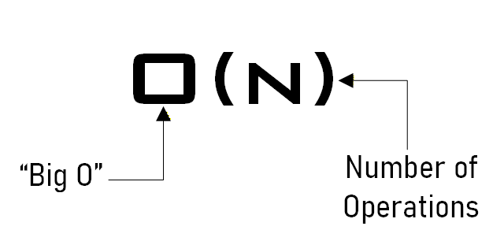

# Big O Notation 

Big O natation tells you how fast an algorithm is. 

Big-O notation is a way to describe how an algorithm's runtime or memory usage grows as the input size grows, focusing on the **worst-case behavior**.

It answers this question: 

*If the input becomes very large, how mush slower (or more memory hungry) will the algorithm become?* 

>
> 
> Big O notation 

## Where are the seconds? <br>
Big O does not tell you the speed in seconds. Big O notation lets you compare the number of operations. It tells you how fast the algorithm grows.

## Common Big-O Classes (From Best to Worst)

| Big-O          | Name         | Example               |
| -------------- | ------------ | --------------------- |
| **O(1)**       | Constant     | Array index access    |
| **O(log n)**   | Logarithmic  | Binary search         |
| **O(n)**       | Linear       | Loop over array       |
| **O(n log n)** | Linearithmic | Merge sort            |
| **O(n²)**      | Quadratic    | Nested loops          |
| **O(2ⁿ)**      | Exponential  | Brute-force recursion |
| **O(n!)**      | Factorial    | Traveling Salesman    |

> 
> Big O Complexity Chart 

## Why Big-O Matters? 
Big-O helps you: <br> 
• Compare algorithms independently of **hardware** <br>
• Predict **scalability** <br>
• Choose the right data structure <br><br>
It ignores: <br>
• Constant factors<br> 
• Exact execution time<br> 
• Machine-specific details <br><br>


## Big-O for Time vs Space — What’s the Difference?
Big-O notation can describe two different resources an algorithm consumes: <br>
1. **Time Complexity** -> How long it takes to run <br> 
2. **Space Complexity** -> How much extra memory it uses. <br><br>

They are **related but independent**.

### Time Complexity
**Time complexity** measures how the number of operations grows as the input size n grows. 
It answers: 
> *How does runtime scale when input gets larger?*

### Space Complexity 
**Space complexity** measures how much extra memory an algorithm uses in addition to the input.

It answers: 
> *How mush additional memory does the algorithm need?*

⚠️ Important:<br>
• Input itself is **not counted** <br>
• Only auxiliary (extra) **memory** is counted <br><br>


Example: 
```python
def sum_list(arr):
    total = 0
    for x in arr:
        total += x
    return total
```
Loop runs **n** times <br>
➜ Time: O(n) <br>
➜ Space: O(1) (only one variable) <br><br>

## Using big-O notation to understand data structures


## The difference between worst-case, average, and amortized analysis

## 

## What can cause Time in a Function? 
• Operations (+, -, /, ...) <br>
• Comparisons (<, >, ==, ...) <br>
• Looping (For, While, ...) <br>
• Outside Function call (Function()) <br>

## Sorting Algorithms 


| Sorting Algorithms|Space Complexity|Time Complexity   |Time Complexity |
| ----------------- | -------------- | ---------------- | -------------- |
|| Worst case| Best Case | Worst Case |
|Insertion Sort|O(1)    |O(n)      |O(n^2)|
|Selection Sort|O(1)    |O(n^2)    |O(n^2)|
|Bubble Sort   |O(1)    |O(n)      |O(n^2)|
|Mergesort     |O(n)    |O(n log n)|O(n log n)|
|Quicksort     |O(log n)|O(n log n)|O(n^2)|
|Heapsort      |O(1)    |O(n log n)|O(n log n)|


## Common Data Structure Operations
| Worst Case ->      |Access |Search|Insertion |Deletion |Space Complexity |
| ------------------ | ---- | ----- | -------- | ------- | --------------- |
| Array              | O(1) | O(n)  |O(n)      |O(n)     |O(n)     |
| Stack              | O(n) | O(n)  |O(1)      |O(1)     |O(n)     |
| Queue              | O(n) | O(n)  |O(1)      |O(1)     |O(n)     |
| Singly-Linked List | O(n) | O(n)  |O(1)      |O(1)     |O(n)     |
| Doubly-LInked List | O(n) | O(n)  |O(1)      |O(1)     |O(n)     |
| Hash Table         | N/A  | O(n)  |O(n)      |O(n)     |O(n)     |

## Rule Book 

**Rule 1**: Always worst Case <br>
**Rule 2**: Remove Constants <br>
**Rule 3**: <br>
    • Different inputs should have different variables: O(a+b)<br>
    • A and B arrays nested would be: O(a * b)<br>
    + for steps in order<br>
    * for nested steps<br>
**Rule 4**: Drop Non-dominant terms<br>

## What Causes Space Complexity? 
• Variables <br>
• Data Structures <br>
• Function Call <br>
• Allocations <br>