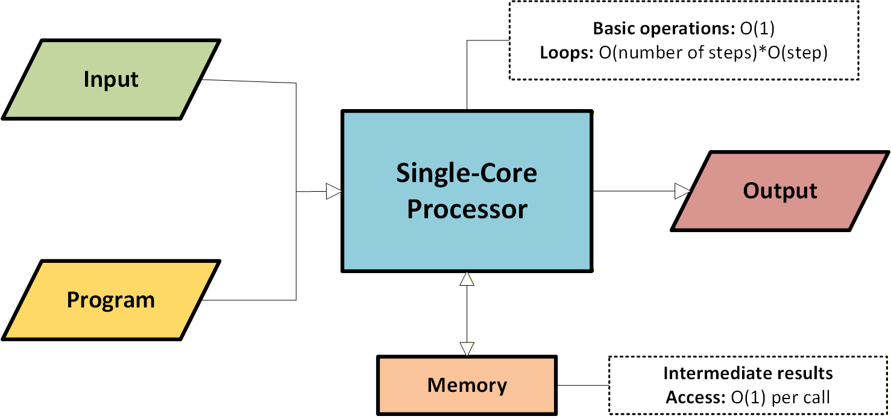

# Big O Notation 

Big O natation tells you how fast an algorithm is. 

Big-O notation is a way to describe how an algorithm's runtime or memory usage grows as the input size grows, focusing on the **worst-case behavior**.

It answers this question: 

*If the input becomes very large, how mush slower (or more memory hungry) will the algorithm become?* 

>
> 
> Big O notation 

## Where are the seconds? <br>
Big O does not tell you the speed in seconds. Big O notation lets you compare the number of operations. It tells you how fast the algorithm grows.

## Common Big-O Classes (From Best to Worst)

| Big-O          | Name         | Example               |
| -------------- | ------------ | --------------------- |
| **O(1)**       | Constant     | Array index access    |
| **O(log n)**   | Logarithmic  | Binary search         |
| **O(n)**       | Linear       | Loop over array       |
| **O(n log n)** | Linearithmic | Merge sort            |
| **O(n²)**      | Quadratic    | Nested loops          |
| **O(2ⁿ)**      | Exponential  | Brute-force recursion |
| **O(n!)**      | Factorial    | Traveling Salesman    |

> 
> Big O Complexity Chart 

## Why Big-O Matters? 
Big-O helps you: <br> 
• Compare algorithms independently of **hardware** <br>
• Predict **scalability** <br>
• Choose the right data structure <br><br>
It ignores: <br>
• Constant factors<br> 
• Exact execution time<br> 
• Machine-specific details <br><br>


## Big-O for Time vs Space — What’s the Difference?
Big-O notation can describe two different resources an algorithm consumes: <br>
1. **Time Complexity** -> How long it takes to run <br> 
2. **Space Complexity** -> How much extra memory it uses. <br><br>

They are **related but independent**.

### Time Complexity
**Time complexity** measures how the number of operations grows as the input size n grows. 
It answers: 
> *How does runtime scale when input gets larger?*

### Space Complexity 
**Space complexity** measures how much extra memory an algorithm uses in addition to the input.

It answers: 
> *How mush additional memory does the algorithm need?*

⚠️ Important:<br>
• Input itself is **not counted** <br>
• Only auxiliary (extra) **memory** is counted <br><br>


Example: 
```python
def sum_list(arr):
    total = 0
    for x in arr:
        total += x
    return total
```
Loop runs **n** times <br>
➜ Time: O(n) <br>
➜ Space: O(1) (only one variable) <br><br>

## Profiling and Asymptotic analysis 
We have two ways to measure an algorithm performance **Profiling** and **Asymptotic Analysis**: <br>
> Asymptotic analysis tells me how an algorithm scales; profiling tells me where it's actually slow. <br>
> Big-O → "Is this algorithm fundamentally viable?"<br>
> Profiling → "Why is my program slow right now?"<br>

### Profiling 
Profiling measures what actually happens at runtime on a real machine. <br>
> Where is my program really spending time or memory?

**What profiling measures** <br>
• CPU time per function <br>
• Memory allocation <br>
• Cache misses <br>
• I/O wait <br>
• Call frequency <br>
• Hot paths <br>

There are already tools available that do most of the work: https://docs.python.org/3/library/profile.html


**Example (Python profiling)**
```python
import cProfile

cProfile.run("my_function()")
```
Outputs shows:<br> 
• Which function run the most <br>
• Which consume the most time <br>

### Asymptotic Analysis (Theory)
Asymptotic analysis studies how an algorithm scales as the input size grows, ignoring machine-specific details. <br>
"The goal of asymptotic analysis is to find mathematical formulas that describe how an algorithm behaves as a function of its input. With these formula it's easier for us to generalize our results to any size of the input, and to check how the performance of two algorithms compares as the size of the input grows toward infinity. "
> grokking Data Structures, Marcello La Rocca

> What happens when n becomes very large? 
**Core tools** <br> 
• **Big-O** -> upper bound (worst case) <br> 
• **Ω (Omega)** → lower bound (best case) <br>
• **Θ (Theta)** → tight bound <br>

Example
```python
def sum_array(arr): 
    total = 0
    for x in arr:
        total += x 
    return total
```
• Time complexity: O(n) <br>
• Space complexity: O(1) <br>

### Which one should I use? 
Both profiling and asymptotic analysis are useful, at different stages of the
development process. Asymptotic analysis is mostly used in the design
phase because it helps you choose the right data structures and algorithms 
at least on paper. <br>

Profiling is useful after you have written an implementation, to check for
bottlenecks in your code. It detects problems in your implementation, but it
can also help you understand if you are using the wrong data structure, in
case you skipped the asymptotic analysis or drew the wrong conclusions.<br>
> grokking Data Structures, Marcello La Rocca

## The RAM model 

When we talk about the RAM model, RAM stands for random-access machine, not random-access memory. <br>

Thi is a simplification, a model where memory is not hierarchical, like real computers (where you can have disk, RAM, cache, registries, and so on). there is only one type of memory, but it is infinitely available. <br>

> 
> The Random Access Machine

In this simplified model the single-core processor offers only a few instructions: mainly those for arithmetic, data movement, and flow control. <br>

Each of these instructions can be executed in a constant amount of time <br>

Each of these instructions can be executed in a constant amount of time (exactly the same amount of time for each of them). <br>

Of course, some of these assumptions are unrealistic, but they also make sense: For example, the available memory can’t be infinite, and not all operations have the same speed, but these assumptions are fine for our analysis, and they even make sense in a certain way.<br>
> grokking Data Structures, Marcello La Rocca

## The difference between worst-case, average, and amortized analysis

## What can cause Time in a Function? 
• Operations (+, -, /, ...) <br>
• Comparisons (<, >, ==, ...) <br>
• Looping (For, While, ...) <br>
• Outside Function call (Function()) <br>

## Sorting Algorithms 


| Sorting Algorithms|Space Complexity|Time Complexity   |Time Complexity |
| ----------------- | -------------- | ---------------- | -------------- |
|| Worst case| Best Case | Worst Case |
|Insertion Sort|O(1)    |O(n)      |O(n^2)|
|Selection Sort|O(1)    |O(n^2)    |O(n^2)|
|Bubble Sort   |O(1)    |O(n)      |O(n^2)|
|Mergesort     |O(n)    |O(n log n)|O(n log n)|
|Quicksort     |O(log n)|O(n log n)|O(n^2)|
|Heapsort      |O(1)    |O(n log n)|O(n log n)|


## Common Data Structure Operations
| Worst Case ->      |Access |Search|Insertion |Deletion |Space Complexity |
| ------------------ | ---- | ----- | -------- | ------- | --------------- |
| Array              | O(1) | O(n)  |O(n)      |O(n)     |O(n)     |
| Stack              | O(n) | O(n)  |O(1)      |O(1)     |O(n)     |
| Queue              | O(n) | O(n)  |O(1)      |O(1)     |O(n)     |
| Singly-Linked List | O(n) | O(n)  |O(1)      |O(1)     |O(n)     |
| Doubly-LInked List | O(n) | O(n)  |O(1)      |O(1)     |O(n)     |
| Hash Table         | N/A  | O(n)  |O(n)      |O(n)     |O(n)     |

## Rule Book 

**Rule 1**: Always worst Case <br>
**Rule 2**: Remove Constants <br>
**Rule 3**: <br>
    • Different inputs should have different variables: O(a+b)<br>
    • A and B arrays nested would be: O(a * b)<br>
    + for steps in order<br>
    * for nested steps<br>
**Rule 4**: Drop Non-dominant terms<br>

## What Causes Space Complexity? 
• Variables <br>
• Data Structures <br>
• Function Call <br>
• Allocations <br>


## Summary 
* To evaluate the performance of an algorithm, we can use asymptotic analysis, which means finding out a formula, expressed in **big-O notation**, that describes the behavior of the algorithm on the **RAM model.**
* The **RAM model** is a simplified computational model of a generic computer that provide only a limited set of basic instructions, all of which take constant time.
* **Big-O notation** is used to classify functions based on their asymptotic growth. We use these classes of functions to express how fast the running time or memory used by an algorithm grows as the input becomes larger. 
* **Some of the most common classes of functions**:
    * **O(1) - constant**: whenever a resource grows independently of n (for example, a basic instruction).
    * **O(log(n)) - logarithmic**: slow growth, like binary search. 
    * **O(n) - linear**:  a function that grows at the same rate as the input, like the number of comparisons you need in a linear search. 
    * **O(n*log(n)) - linearithmic**
    * **O(n^2) - quadratic:** functions in this class groe too fast for resources to be manageable beyond about a million elements. An example is the number of pairs in an array. 
    * **O(2^n) - exponential:** functions with exponential growth have huge values for n>30 already. So of you want to compute all the subsets of an array, you should know that you can only do this on small arrays. 
> grokking Data Structures, Marcello La Rocca