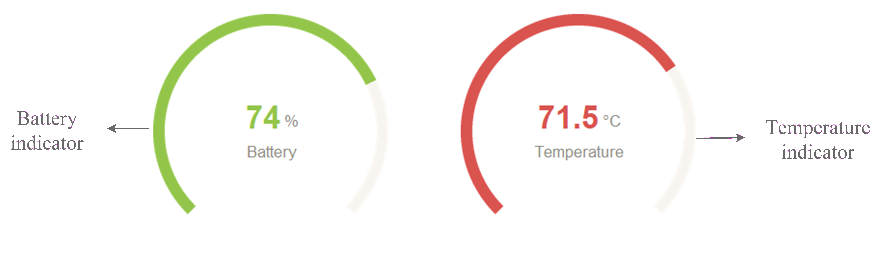
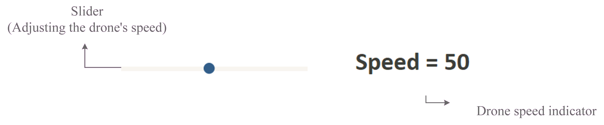

icon:material/book-open-blank-variant

The graphical user interface (GUI) is the main control panel used to operate the drone. Through this interface, the user can monitor important system information, adjust flight parameters, and send commands in real time. The following sections describe each part of the interface and its function within the system.

>
> 
> Preview

## Getting Started 
!!! warning "Before to start"
    Before to start check the user manual for the correct handling of the drone: 
    ["Tello user manual"](https://dl-cdn.ryzerobotics.com/downloads/Tello/Tello%20User%20Manual%20v1.4.pdf "user-manual")

## Launching the application
!!! info "Before launching"
    Make sure you are connected to the DJI Tello drone's WiFi network, take the following table into consideration:

    |  **Distance**  |  **Signal Quality**  | **Description**  |
    | -------------- | -------------------- | ---------------- |
    |0-5 m| :material-wifi-strength-4: **Strong (4-5 bars)** | Stable control + smooth 720p feed |
    |5-15 m| :material-wifi-strength-3: **Good (3-4 bars)**| Mostly stable, rare hiccups |
    |15-25 m| :material-wifi-strength-2: **Fair (2-3 bars)**| Occasional stutter, increased lag |
    | 25-30 m| :material-wifi-strength-1: **Weak (1-2 bars)** | video drops likely |
    |>30 m | :material-wifi-strength-1-alert: **Very weak** | Control and video may fail |


### Method 1 **"Using ros2 launch"** (Recommended)
Open your workspace: 
```bash
cd drone_simple_gui_ws
```
Activate your Python virtual environment: 
```bash
source venv/bin/activate
```
Activate your ros2 environment: 
```bash
source install/setup.bash
```
Use the next command to Launch the application: 
```bash
ros2 launch simple_gui_bringup simple_gui.launch.xml
```

### Method 2 **"Using ros2 run"**
Open two terminals, your workspace and activate your Python and ROS 2 workspaces in each terminal:
```bash
cd drone_simple_gui_ws
source venv/bin/activate
source install/setup.bash
```
Start the GUI node with the next command: 
```bash
ros2 run send_receive_drone drone_gui 
```
Start the node responsible for communication with the DJI Tello drone with the next command: 
```bash
ros2 run sed_receive_drone drone_control
```
## GUI
This section outlines explains the components that form the graphical user interface (GUI).

### GUI Elements
**Status Indicators**: 
The status indicators allow the user to evaluate battery availability and thermal conditions before and during flight.

>
> 
> Status Indicators 

* **Battery**: Visualized through a circular progress chart that displays the remaining battery percentage of the drone. This indicator is crucial for estimating safe operating time and preventing battery depletion mid-flight. 
* **Temperature**: A second circular chart shows the drone's current operating temperature. Monitoring temperature helps prevent overheating and ensures safe operation during prolonged or high-demand flight conditions. 

**Speed Control**
In the central section of the interface, a slider provides direct control of the drone's flight speed, giving the user a fast and intuitive way to adjust motion intensity during manual flight.

>
> 
> Speed Slider

The slider range goes from 0 to 100, and the current selected speed value is displayed numerically to the right of the slider. This visual reference allows precise control inputs and supports real-time parameter tunning. 

**Camera Feed**
The interface includes a real-time video captured from the drone's onboard camera, enabling live situational awareness of the environment. 

**Dropdown Menu**
The drone control menu centralizes primary flight actions, simplifying mission execution and basic emergency responses. 

* **Takeoff**: Initiates the drone's **takeoff** sequence when pressed, allowing the aircraft to automatically ascend and stabilize at initial altitude. 
* **Land**: Commands the drone to safely descend and complete the landing sequence when activated. 
* **Connect**: Start the communication with the drone.

**Movement Controls**:
Manual motion controls allow direct input for navigation and positioning of the drone in 3D space, complementing the speed and enabling precise flight.
>
> 
> controls 

* **Yaw and Altitude controls**: Located on the left side of the interface, these controls adjust vertical movement (ascending / descending) and rotation around the vertical axis (clockwise or counterclockwise).
* **Roll and Pitch controls**: Located on the right side, these controls allow moving the drone left, right, forward and backward while maintaining altitude, enabling full motion control within the horizontal plane.

### Keyboard Functions: 
The keyboard functions implemented within the interface allow manual control of the drone through direct key inputs. Each key is mapped to a specific flight control action: 

* **A and D**: Control the drone's **Yaw** movement (rotation about the vertical axis). 
* **W and S**: Corresponds to **Throttle** control, increasing or decreasing altitude respectively.
* **Up Arrow and Down Arrow**: Move the drone **Forward** and **Backward**.
* **Left Arrow and Right Arrow**: Correspond to **Pitch** control, allowing lateral movement (left and right). 
* **I**: Initiates **Take Off**.
* **Q**: Executes **Landing**.