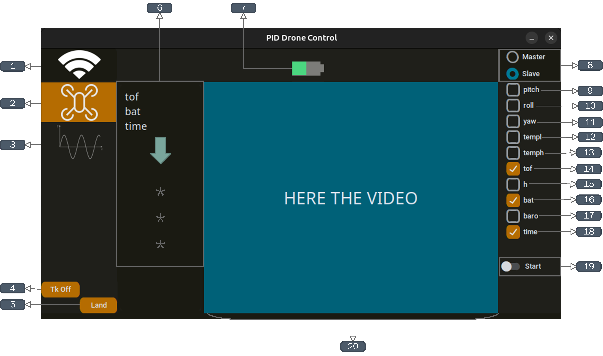
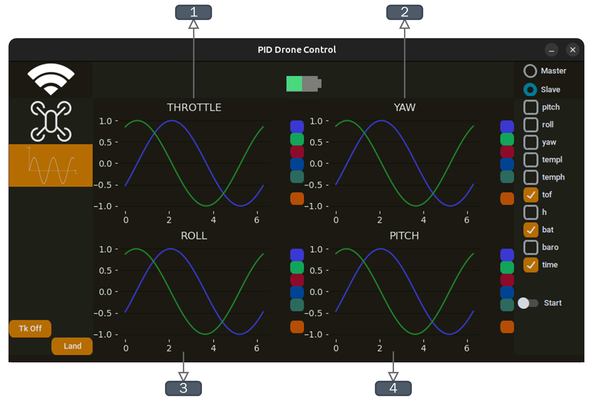
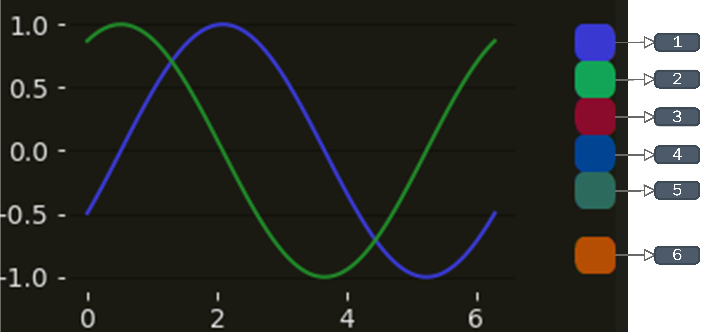
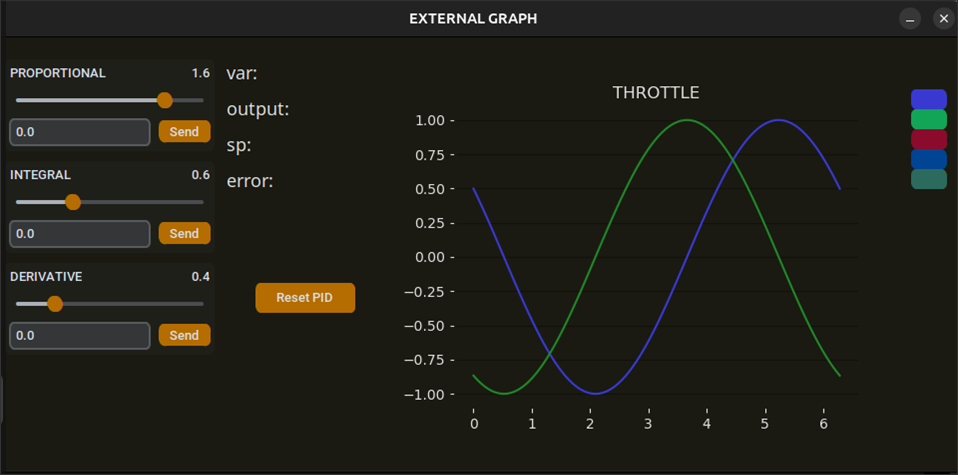
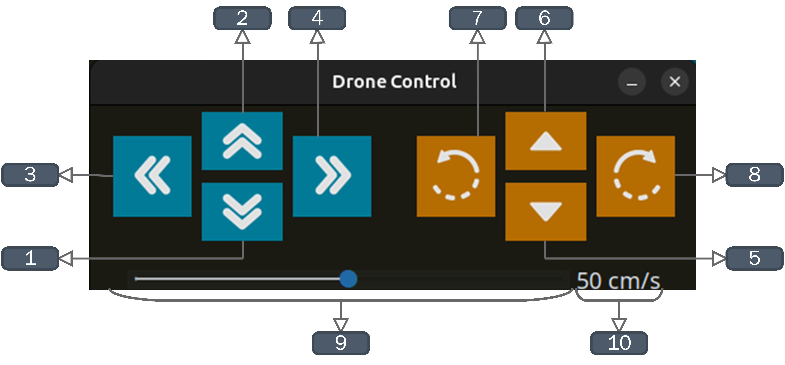

icon:material/book-open-blank-variant


## Getting Started 
!!! warning "Before to start"
    Before to start check the user manual for the correct handling of the drone: 
    ["Tello user manual"](https://dl-cdn.ryzerobotics.com/downloads/Tello/Tello%20User%20Manual%20v1.4.pdf "user-manual")

## Launching the application
!!! info "Before launching"
    Make sure you are connected to the DJI Tello drone's WiFi network, take the following table into consideration:

    |  **Distance**  |  **Signal Quality**  | **Description**  |
    | -------------- | -------------------- | ---------------- |
    |0-5 m| :material-wifi-strength-4: **Strong (4-5 bars)** | Stable control + smooth 720p feed |
    |5-15 m| :material-wifi-strength-3: **Good (3-4 bars)**| Mostly stable, rare hiccups |
    |15-25 m| :material-wifi-strength-2: **Fair (2-3 bars)**| Occasional stutter, increased lag |
    | 25-30 m| :material-wifi-strength-1: **Weak (1-2 bars)** | video drops likely |
    |>30 m | :material-wifi-strength-1-alert: **Very weak** | Control and video may fail |

### Method 1
Open tree terminals, open your workspace and activate your Python and ROS 2 workspaces in two of them:
```bash
cd my_ros_ws
source venv/bin/activate 
source install/setup.bash  
```
Start the GUI node with the next command: 
```bash
ros2 run drone_ctrl gui_node
```
Start the node responsible for communication with the DJI Tello drone with the next command: 
```bash
ros2 run drone_comm drone_comm
```
open your hailo environment and activate the python environment: 
```bash
cd hailo-apps-infra
source setup_env.sh
```
Open and start the node responsible for the object tracking with the next command: 
```bash
cd ros_dt_ws
ros2 run hailo_dt_pkg hailo_detection
```

## Interface Elements 
This section describes each component of the graphical interface and its function within the system. Every button, control, and display area plays a specific role in enabling drone operation, monitoring, and interaction. The following list explains the purpose of each element and how it contributes to the overall control workflow.  

### Main Window
>
> 
> Main Window 

1. **Establish Connection**:
This button initializes the communication between the Raspberry Pi 5 and the DJI Tello drone, enabling data exchange and control commands between both devices. 
2. **Telemetry Visualization**: 
This button enables the reception of telemetry data from the drone. Once activated, the incoming telemetry values are displayed in sections 6 and 7 of the interface. 
3. **Controller Response**:
This buttons allows enabling 
the visualization of the controller's output response in real time. This feature is useful to analyze how the control algorithm reacts to disturbances or parameter changes.
4. **Takeoff**:
Executes the automatic *takeoff* routine and begins the drone's flight operation. 
5. **Landing**:
Executes the autonomous landing command of the unmanned aerial vehicle (UAV).
6. **Selected Telemetry Data**:
This section displays the telemetry parameters selected by the user. The selectable telemetry options corresponds to item 9 through 18. 
7. **Battery Status**:
Displays the current drone battery level using a visual progress bar indicator. 
8. **Operating Mode**:
Allows selecting between two operating modes: 
    * **Master**: The drone directly controlled by the user. 
    * **Slave**: The drone performs autonomous follower behavior, maintaining tracking of a leader drone through visual detection and autonomous control. 
9. **Pitch**:
Checkbox that enables the display of the aircraft's forward/backward tilt angle (in degrees). 
10. **Roll**:
Enables visualization of the drone's lateral inclination angle (in degrees)
11. **Yaw**:
Displays the drone's heading angle with respect to the vertical axis (rotation in degrees).
12. **Minimum Temperature (templ)**:
Displays the lowest internal temperature measurement registered y the system. 
13. **Maximum Temperature (temph)**:
Displays the highest internal temperature reading detected by the drone. 
14. **Time of Flight (TOF)**:
Indicates the approximate distance to the ground using the infrared sensor (in centimeters).
15. **Estimated Height (height)**:
Shows the approximate height of the drone relative to the ground (in centimeters)
16. **Battery Level (bat)**:
Displays the current numeric percentage of the drone's battery charge. 
17. **Barometric Height (baro)**:
Shows the estimated altitude derived from atmospheric pressure readings. 
18. **Flight Time (time)**:
Displays the total elapsed time since takeoff (in seconds). 
19. **PID Control Activation**:
This switch activates the corresponding PID controller. In **Master mode** it enables a single PID controller, in **Slave mode** it activates multiple PID controllers simultaneously to perform coordinated multi-drone behavior. 
20. **Video Streaming**:
Displays the real-time video captured by the drone's camera. In **Slave mode**, this module also allows enabling visual detections used to track the leader drone.

### Master/Slave Graphs

In **Slave mode** the drone performs a following behavior relative to the motion and position of the leader drone. This behavior is achieved through real-time object detection. The four PID plots (Throttle, Yaw, Roll, and Pitch) show the temporal response of each PID controller, which regulate the dynamics of the slave drone in order to maintain its position relative to the leader 

>
> 
> Slave Graphs 

1. **Throttle (Altitude)**:
This controller regulates the vertical displacement of the slave drone along the Z-axis, adjusting its climb and descent rate using a **P**roportional-**I**ntegral-**D**erivative (PID) signal. Its main objective is to maintain a stable relative altitude with respect to the leader drone, ensuring synchronized vertical positioning during flight. 

2. **Yaw (Rotation around the vertical axis)**:
The yaw controller manages the drone's heading around the Z-axis enabling rotation over its own axis. Its purpose is to align the orientation of the slave drone with the leader drone, ensuring both maintain coherent directional alignment during motion. 

3. **Roll(Lateral movement)**:
This controller acts on the X-axis, which corresponds to the drone's lateral displacement (left or right). Its goal is to correct the slave drone's horizontal side-ti-side position relative to the leader, providing precise lateral alignment between both drones. 

4. **Pitch(Forward/Backward movement)**:
The pitch controller regulatess motion along the Y-axis, enabling forward and backward movement. Its function is to maintain a constant longitudinal distance from the leader drone, which is essential to preserve the formation during follower behavior.

In **Master mode**, a direct control is established between the user and the aircraft. The PID controller, designed and implemented within the graphical interface, regulates the drone's vertical motion (ascent and descent). This control uses feedback from the infrared Time-of-Flight (Tof) distance sensor, enabling accurate altitude adjustment. 

>
> 
> Master Graph

### PID Controller Variables 

This section describes the available control variables that can be enabled or disabled within the interface to visualize their temporal behavior in the PID graph. Each control parameter can be independently selected, allowing the user to monitor specific responses of the system during flight and evaluate how the controller is regulation the drone's motion in real time.

>
> 
> Graph Buttons

1. **System Variable**: 
Displays the measurement output  of hte system. For the drone, this corresponds to the physical quantities that define its dynamic behavior such altitude (Throttle), yaw rotation, lateral displacement(Roll), or longitudinal motion (Pitch). 
2. **Setpoint**: 
Shows the target reference value for the selected variable. This is the value the controller aims to reach and maintain. 
3. **Error**:
Displays the difference between the current system variable and the setpoint. This metric defines how far the system is from the desired reference value. 
4. **Output**: 
Shows the controller's output command. This signal corresponds to the resulting linear or rotational velocity in cm/s, depending on the variable being controlled. 
5. **Controller Activation/Deactivation**: 
Each PID controller can be independently enabled or disabled in real time. 
6. **External Plot Window**:
Opens an external window showing the selected PID plot, provides numerical values the temporal variable of the system, and enables tuning of PID gains. 

As previously mentioned in point 6, the dedicated interface button allows opening a pop-up window that displays an external graph corresponding to the selected variable. This external visualization provides multiple integrated capabilities: 

>
> 
> External Graph

* **Real-time response visualization**: The graph shows the temporal behavior of the system in real time, including the controlled variable, the tracking error, and the PID controller output signal. 
* **Numerical value display**: The window presents numerical values for each parameter, enabling detailed inspection of the system state at different points in time. 
* **Interactive PID gain tuning**: The user can adjust the PID controller gains (Kp, Ki, Kd) in real time, and observe the immediate effect of parameter changes on the system's dynamic response. 

### Direct control interface for Master mode
Manual movement controls provide direct user input for positioning and navigating the drone within 3D space. These controls complement speed adjustment and enable precise maneuverability during flight. 

>
> 
> Movement Buttons

* **Yaw and Altitude Controls**: Located on the left side of the interface. These adjust the drone's vertical displacement (ascend/descend) and rotational motion around the vertical axis (clockwise or counterclokwise).

* **Roll and Pitch Controls**: Located on the right side. These allow movement to the left, right, forward and backward while keeping altitude stable, enabling full horizontal plane control.

**Keyboard Inputs** 
The interface also provides keyboard shortcuts that map specific keys to flight commands, allowing manual control without interacting directly with the on-screen elements:

* **A/D**: Yaw rotation (left/right).
* **W/S**: Throttle control (increase/decrease altitude).
* **Up Arrow and Down Arrow**: Control the drone's *Pitch* forward and backward movement, allowing the aircraft to advance or retreat in space. 
* **Left Arrow and Right Arrow**: Control the drone's *Roll*, enabling lateral displacement to the left or right while maintaining altitude.  
* **I**: Takeoff command.
* **Q**: Landing command.