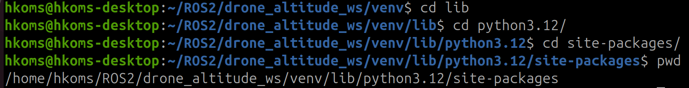
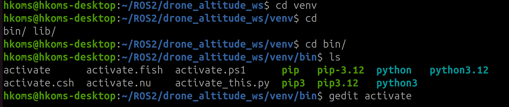
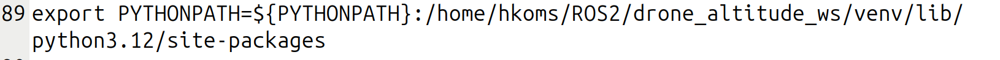

icon:fontawesome/solid/gear

This section provides a guide to install and configure the environment required to run the DJI Tello altitude control system on Raspberry Pi 4. It covers dependency installation, ROS 2 Humble setup, and development environment configurations. 

## 1.0 System Requirements

### 1.1 Hardware Requirements
* Raspberry Pi 4 (8GB RAM)
* Storage: 32 GB microSD card (Class 10)
* DJI Tello Drone

### 1.2 Software Requirements
* Operating System: Ubuntu 22.04 LTS (64-bit, ARM)
* Python: 3.10
* ROS 2: Humble Hawksbill distribution
* Additional: Git, pip, Python virtual environment

## 2.0 Environment Setup
### 2.1 Update the system
```bash
sudo apt update && sudo apt upgrade -y
sudo apt install -y curl wget git python3-pip
```
### 2.2 ROS 2 Humble Installation
To install ROS 2 Humble fallow the instructions of the next web page: 
[ROS 2 Humble installation!](https://docs.ros.org/en/humble/Installation/Ubuntu-Install-Debs.html "ROS 2 Humble")

### 2.3 Creating a Python virtual environment 
To verify if **virtualenv** is ready installed, run: 
```bash
virtualenv --version
```
If **virtualenv** is not installed, run: 
```bash
sudo apt update && sudo apt install -y python3-virtualenv
```
Create a new workspace:
```bash
cd ~
mkdir drone_altitude_ws
```
open the directory: 
```bash
cd drone_altitude_ws
```
To create the virtual environment, run: 
```bash
virtualenv -p python3 ./venv
```
Activate the virtual environment using the next source command: 
```bash
source ./venv/bin/activate
```
After you activate the environment your command prompt will change to show that you are in a Python virtual environment.

To use a virtual environment with ROS 2 you must tell colcon to ignore the directory that contains the files that manage the virtual environment: 
```bash
touch ./venv/COLCON_IGNORE
```
To exit your virtual virtual environment type: 
```bash
deactivate
```

To ensure your ROS 2 distribution can access Python packages installed in your virtual environment, you need to explicitly add the virtual environment's Python path to ROS's Python system path. This bridges the gap between your isolated Python environment and the ROS 2 ecosystem.

Add the following lines to your virtual environment's activation script to automatically configure the Python path when the environment is activated:
```bash
export PYTHONPATH=${PYTHONPATH}:/path-to-your-env/lib/python3.10/site-packages
```
??? example "Example: Modify Virtual Environment Activation Script"
    
    !!! note "Your virtual environment's path or your python version will differ. Ensure you use the correct path for your venv name and Python version in the following commands"

    Navigate to your env-package path:
    ```bash
    cd ~/path/to/your/env-package
    ```
    Use the next command to get the absolute path of your current file: 
    ```bash
    pwd
    ```
    > 
    > environment package path

    navigate to your virtual environment activate file: 
    ```bash
    cd ~/path/to/your/activate_file
    ```
    open the activate file using a text editor:
    ```bash
    gedit activate
    ``` 
    > 
    > Open activate file

    Add the env-package path to your activate file: 
    ```bash
    export PYTHONPATH=${PYTHONPATH}:/path-to-your-env/lib/python3.10/site-packages
    ```
    > 
    > Edit activate file

## 3.0 Project Cloning and Initialization
clone the repository into your drone_altitude_ws workspace: 
```bash
git clone https://github.com/LichtenbergCode/tello-pid-altitude-control-ros2.git
```
Activate your Python virtual environment: 
```bash
source venv/bin/activate
```
Install the necessary Python modules for the application: 
```bash
pip install -r requirements -v
```
Compile the packages: 
```bash
colcon build
```
!!! warning "Use ```colcon build``` only within your drone_altitude_ws workspace" 
Activate the environment you just compiled: 
```bash
source install/setup.bash
```
Run the app: 
```bash
ros2 launch drone_altitude_bringup drone_altitude.launch.xml
```

## 4.0 Troubleshooting 
### 4.1 Tello Connection Problems
!!! failure "**Issue: Cannot connect ro Tello drone**"
    Check WiFi connection: 
    ```bash
    nmcli device wifi list
    nmcli connection show
    ```
    Verify Tello WiFi is available:
    ```bash
    sudo iwlist scan | grep -i tello
    ```
    Restart network manager:
    ```bash
    sudo systemctl restart NetworkManager
    ```
### 4.2 Module problems
!!! bug "**Issue: "ModuleNotFoundError: No module named 'matplotlib.tri.triangulation'"**" 
    Uninstall matplotlib in your virtual environment: 
    ```bash
    pip uninstall matplotlib -y
    ```
