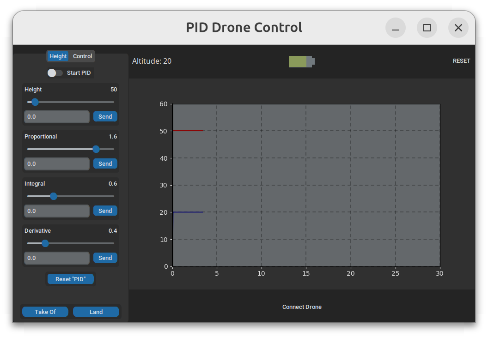
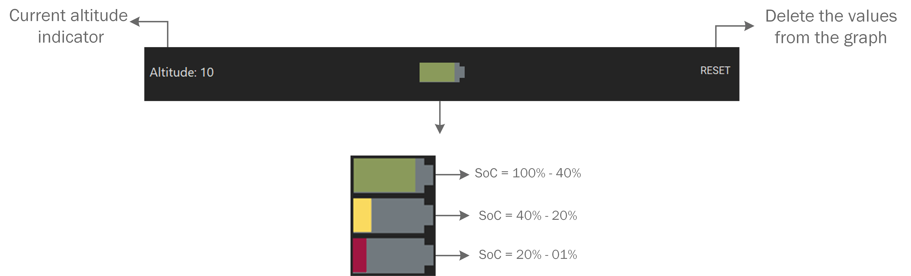
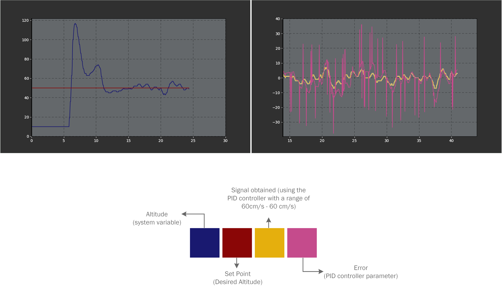

icon:material/book-open-blank-variant

This section explains how to use the system once it has been installed.
It covers startup instructions, the graphical interface, basic operations and system monitoring.

>
> 
> Preview

## Getting Started 
!!! warning "Before to start"
    Before to start check the user manual for the correct handling of the drone: 
    ["Tello user manual"](https://dl-cdn.ryzerobotics.com/downloads/Tello/Tello%20User%20Manual%20v1.4.pdf "user-manual")

## Launching the application
!!! info "Before launching"
    Make sure you are connected to the DJI Tello drone's WiFi network, take the following table into consideration:

    |  **Distance**  |  **Signal Quality**  | **Description**  |
    | -------------- | -------------------- | ---------------- |
    |0-5 m| :material-wifi-strength-4: **Strong (4-5 bars)** | Stable control + smooth 720p feed |
    |5-15 m| :material-wifi-strength-3: **Good (3-4 bars)**| Mostly stable, rare hiccups |
    |15-25 m| :material-wifi-strength-2: **Fair (2-3 bars)**| Occasional stutter, increased lag |
    | 25-30 m| :material-wifi-strength-1: **Weak (1-2 bars)** | video drops likely |
    |>30 m | :material-wifi-strength-1-alert: **Very weak** | Control and video may fail |

### Method 1 **"Using ros2 launch"** (Recommended)
Open your workspace: 
```bash
cd drone_altitude_ws
```
Activate your Python virtual environment: 
```bash
source venv/bin/activate
```
Activate your ros2 environment: 
```bash
source install/setup.bash
```
Use the next command to Launch the application: 
```bash
ros2 launch drone_altitude_bringup drone_altitude.launch.xml
```

### Method 2 **"Using ros2 run"**
Open tree terminals, your workspace and activate your Python and ROS 2 workspaces in each terminal:
```bash
cd drone_altitude_ws
source venv/bin/activate
source install/setup.bash
```
Start the GUI node with the next command: 
```bash
ros2 run drone_pid_altitude gui_pid 
```
Start the node responsible for communication with the DJI Tello drone with the next command: 
```bash
ros2 run drone_pid_altitude drone_control_pid
```
Start the node responsible for the flight altitude control algorithm with the next command: 
```bash
ros2 run drone_pid_altitude drone_loop_pid
```

## GUI 
This section provides a description of the elements that make up the graphical user interface (GUI). 

### GUI Elements:
On the left side of the main window, there is an operations menu divided into two main segments: **Height** and **Control**.
>
>
> GUI Controls

In the **Height** tab, all controllers related to drone altitude management are grouped: 

* **Start PID**: Starts the PID controller for altitude control. 
* **Height**: Allows the definition of the reference value (setpoint) for the controller. 
* **Proportional(P), Integral (I), Derivative(D)**: Provide visualization and dynamic adjustment of the PID controller gains. 
* **Reset PID**: Restores the PID gains to their default values. 
* **Takeoff and Land**: Commands to initiate takeoff and landing of the drone, respectively. 

The **Control** tab is oriented towards adjusting the drone's operating speed and managing real-time data visualization: 

* **Speed**: Controls the drone's speed when operated through keyboard inputs.
* **Graph1 and Graph2**: Allow the selection between different variables —Height, Setpoint (SP), Error, and Control Signal— for graphical representation. 
* **Graph State**: Toggles between two data display modes: *Incremental*, which shows the complete measurement history, and *Real Time*, which displays only the most recent data. 
* **Table**: Provides access to a table that displays the data stored in the database during the operation process. 

At the top of the graphical user interface, three main elements are located, designed to facilitate both control and efficient monitoring of the system. Each of these components fulfills specific functions that contribute to real-time tracking of the drone's critical variables. 

>
>
> Elements of the top

**Altitude**:
This numerical indicator reflects the state variable that the control system aims to regulate, that is, the actual altitude of the drone. The displayed value is updated in real time, providing the operator with a precise reference of the aircraft's dynamic behavior during flight. 

**Battery Indicator**:
Represents the State of Charge (SoC) of the drone's battery. This indicator allows the user to continuously monitor the amount of energy available. 

The battery charge percentage is represented using a color-coding scheme, designed to provide a visual interpretation of the drone's energy state. Each charge percentage range is associated with a specific color, according to the following criteria: 

* :green_circle:: indicates a state of charge above 40% in which the drone can operate without any issues.
* :yellow_circle:: Represents a charge state in which the drone may continue operating, but it is recommended to remain attentive to energy consumption. This corresponds to a range between 40% and 20%.
* :red_circle:: Denotes an energy state below 20% which indicates the need for landing in order to prevent damaging the integrity of the drone.


**RESET**:
This button execute the reset function for the data list used to generate the real-time graph. When activated, only the temporary records employed for graphical representation are deleted, allowing a clean restart of the visualization without affecting the persistent data stored in the system database. This functionality is particularly useful for analyzing new test sequence or modification to control parameters without interference from previous records.

### Keyboard Functions
The system supports manual command input through keyboard interaction. Each key corresponds to a specific movement or flight operation: 

* **A and D**: Adjust the drone's *Yaw* motion (rotation about the vertical axis).
* **W and S**: Control Throttle, increasing or decreasing altitude. 
* **Up Arrow and Down Arrow**: Move the drone *Forward* and *Backward*. 
* **Left Arrow and Right Arrow**: Adjust the drone's *Pitch* to execute lateral motion (left and right).
* **I**: Triggers the *Takeoff* sequence. 
* **Q**: Activates the *Landing* procedure. 

## Monitoring of variables
Within the graph, the key variables involved in altitude control are visualized: altitude, setpoint, control signal, and error. Each of these variables is represented using a distinctive color, enabling clear identification of their behavior over time and facilitating the analysis of the system response. 

>
>
> Graph Element

* :blue_circle: Altitude: Represents the system state variable, showing the drone's current height in real time. This signal reflects the evolution of the vertical position and allows real-time evaluation of the controller's ability to maintain the desired altitude. 
* :red_circle: Setpoint: Corresponds to the reference or target value the system must reach. This variable allows visualization of the desired trajectory and serves as the basis for calculating the tracking error. 
* :yellow_circle: Control Signal: Indicates the output generated by the PID controller, which adjusts the drone's dynamics to minimize the difference between the current altitude and the setpoint. Its analysis provides insight into the controller's response under different operating conditions. 
* :purple_circle: Error: Represents the difference between the setpoint and the drone's actual altitude. This variable is essential for evaluating control system performance, as it allows identifying response speed, stability, and possible oscillation during the regulation process. 
